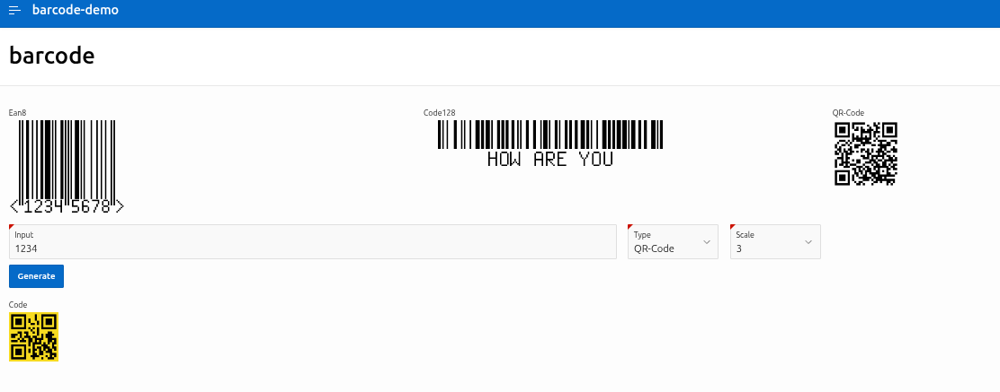
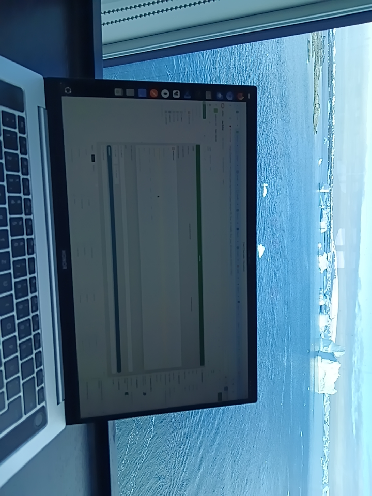

# oracle-apex-barcode
Oracle-APEX-Plugin with an easy to use common interface for the **APEX_BARCODE** for displaying EAN8, Code128 and QR-Codes.
It also supports dynamic settings for the **type** and **size**, so both can be provided in page-items.

Here the [docu](docu/docu.md).

The Demo could be found in the subdirectory **demo**.

Here a [Live-Demo](
https://tlodfjxbrej9i6r-uwe01.adb.eu-frankfurt-1.oraclecloudapps.com/ords/r/uwe/barcode-demo/barcode)

Enter here an **Input** (text or number for EAN8), **Type** (EAN8, Code128, QR-Code) and the **Size** of the graphic. With **Generate** you than can generate the graphic for the **Input**.

# Example
.

# Upcomming Releases
- Support of the plugin inside grids
- Support of other barcode types beyond the 3 from APEX_BARCODE

# Fun fact
The first version of this plugin was implemented in February 2026 on a cruise ship in Antarctica on its way north between 70° and the Antarctic Cycle at 66° South, and is therefore most likely the southernmost implemented APEX plugin.

APEX in Antarctica

Tux in Antarctica

