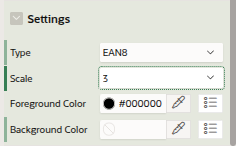
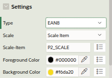
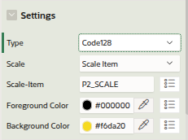
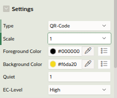
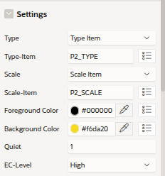

# Barcode- plugin

## Features
The plugin provides an easy to use common interface for the barcode/qrcode API in APEX.
You can use it for displaying 
- EAN8
- CODE138
- QRCODE

The plugin can be configured dynamically in a way, that the type and size can be provided in a page-item.

## Type-codes
When providing the type in a page-item use the following numeric values
- 1 EAN8  (The page-item containing the value must be numeric with up to 8 digits)
- 2 CODE128
- 3 QRCODE

## Usage
To use the barcode-plugin
- import plugin via **shared-components->plugins->import** from file [barcode-plugin](../plug-in/item_type_plugin_barcode_uwesimon_selfhost_eu.sql) 
**../plug-in/item_type_plugin_barcode_uwesimon_selfhost_eu.sql**
- use the plugin on your page
- config the plugin

## Example
The following screenshot shows the usage of the plugin
- Value displayed as a EAN8
- Value displayed as a CODE128
- Value displayed as a QRCODE
- Display depending on selection of type and size

## Config

The plugin supports the scanable type
 - EAN88
 - code128
 - qr-code

It can be used in 2 ways
- fixed configuration of qr-code/barcode type in  page-designer attribute
- dynamic configuration of type and size with page-items at runtime (Type "Type item")

All 3 types have the commen attributes **foreground-color** (default black) and **backgroud-color** (default transparent).
The colors can be selected with a color-picker.

This version of the barcode-plugin can be used for **page-items only**.

The scale of the code can be fixed or dynamic with a page-item (Scale "Scale item") too.

### Fixed configuration

### Configuration of barcodes

This configuration shows the values when the scale of the code is configured with a page-item. 

### Configuration of QR-Code

QR-code has the 2 additional attributes **Quiet** (empty space around the qr-code) and **EC-Level** (Errorcorection level).
The **EC-Level** can have a value of **Low**, **Medium**, **xx**, **High**

### Configuration of barcode/qr-code type with page-item

